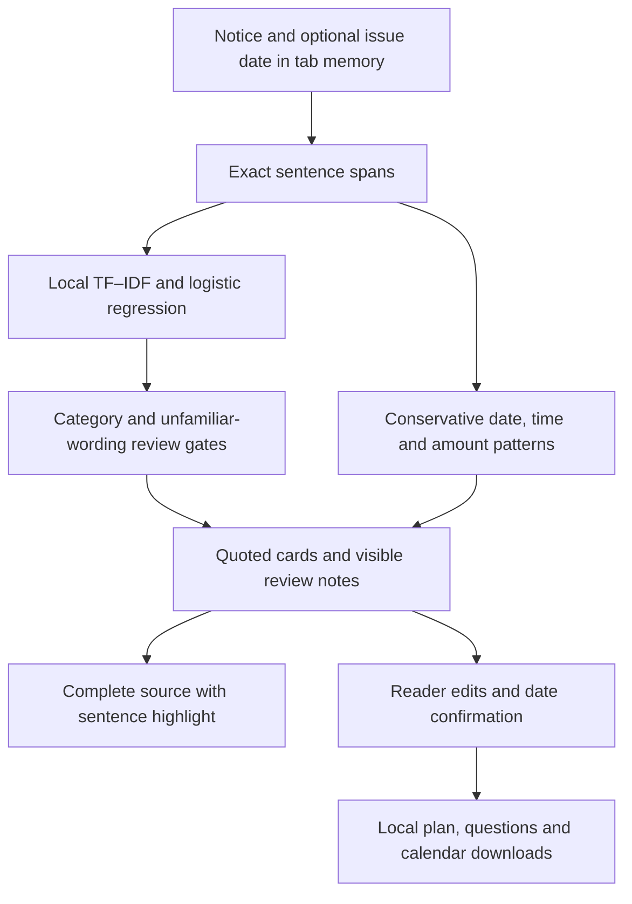

# Architecture

Release 1.4.2 is a static HTML/CSS/JavaScript application. Model 1.1.0 and the extraction/calendar pipeline are unchanged by this presentation release.

## Responsibilities

- `dist/engine.js`: conservative sentence boundaries, original start/end offsets, local features and classifier scores, category review gates, entity patterns and ambiguity flags. Every card’s text equals its source substring. Uncertain cards remain visible; background sentences are accessible separately.
- `dist/model.json`: vocabulary, IDF, coefficients, intercepts and development metadata. `train.py` creates this artifact from authored examples. Classification is four-class logistic regression, not a generative language model. Scores are uncalibrated.
- `dist/followup.js`: explicit clarification templates, conservative same-sentence date suggestions, confirmed reminder validation and RFC 5545 serialization. Lists, alternatives, one-or-both wording and ranges retain distinct meanings. No dates are borrowed from another sentence.
- `dist/app.js`: accessible DOM rendering, source navigation/focus return, reader-controlled state, source freshness guard, downloads and optional WebMCP. DOM text is written as text rather than executable notice markup.
- `dist/index.html` and `style.css`: two-column document workspace that reflows into a single reading column on phones. Checklist, Next steps and Source share the same analysis.
- `prepare.mjs`: fingerprints dependencies before the referring script and page, so cached assets remain matched. Only the prepared `dist` tree is deployed.

## Reader authority and freshness

A model category cannot confirm a reminder. A date suggestion is only a candidate; the reader selects a valid date, checks the confirmation and saves. Editing or unchecking it withdraws the saved event. Questions are editable drafts, never model answers or automatically sent messages. Reviewed marks record checking, not task completion.

The analysis stores the exact source and issue date. If either differs from the current inputs, review/reminder controls and all three exports pause, and the old source snapshot is clearly labeled. A successful changed-source analysis resets derived state. Reanalyzing identical inputs preserves reader work and calendar identifiers; reverting exactly to those inputs restores the matching state. Clear and reload discard it. Already downloaded/imported artifacts are outside the app’s control.

## Data and export boundaries

Inputs, analysis, reviewed IDs, dates, confirmations and drafts live in JavaScript memory in the current tab. No localStorage, server upload, analytics, cloud inference or service worker is used. Same-origin static assets and the model are fetched; the host sees ordinary web requests, not the notice. Assets must first load for offline inference; offline startup is unsupported. Optional WebMCP tools call the same local pipeline and expose the visible plan to a connected browser agent.

Downloads are local Blob URLs, revoked after the click. Plans include the complete original notice. Calendars contain only saved confirmed excerpts, exact quotations and review notes, all-day `VALUE=DATE` entries and an exclusive next-day end. No guessed timezone, timed deadline or alarm is added. Escaping, CRLF and UTF-8 byte folding are tested and independently parsed; actual client imports and duplicate behavior remain unverified.

## Deployment and evidence

The source repository preserves baseline models, evaluation conditions, release checkpoints and export fixtures. GitHub Pages serves `dist` from `gh-pages`; deployment commits retain the previous branch as parent. Runtime has no package dependencies. jsdom/axe are development tools only; local QA diagnostics are excluded from the public build.

[Evaluation](EVALUATION.md) distinguishes raw model labels, gated checklist placement and reader-confirmed reminders. [Accessibility/export audit](docs/accessibility-export-audit.md) records tested behaviors and unverified screen-reader/physical-device/client behavior. [Demo](DEMO.md) uses actual fictional-notice UI captures; its composition tooling is separate from the application runtime.
