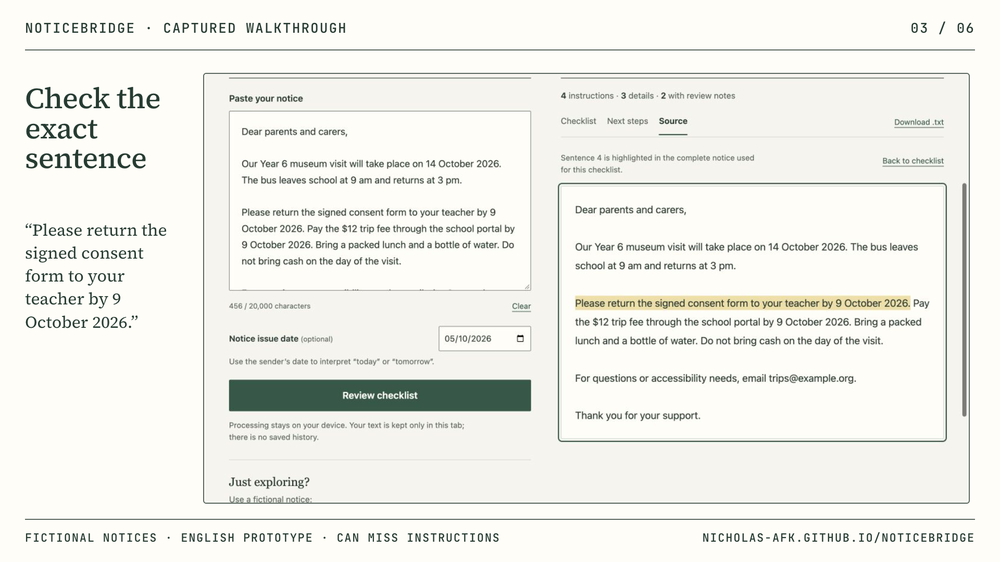

# Demonstration

**[Watch the 52-second walkthrough](https://nicholas-afk.github.io/noticebridge/media/noticebridge-demo.mp4)** · [Use the app](https://nicholas-afk.github.io/noticebridge/)

The silent, captioned video uses six actual browser captures of application 1.4.2/model 1.1.0 and fictional built-in notices. It is a sequence of captured states, not a continuous screen recording. App pixels are preserved; no interface, cursor, sender reply or calendar integration is fabricated. It discloses that this English prototype can miss instructions. There is no accuracy or reader-impact claim.

| Time | Actual behavior shown |
| --- | --- |
| 0–8s | Complete fictional School trip notice entered |
| 8–16s | Four instructions reported; first excerpt marked Reviewed |
| 16–24s | Exact consent sentence highlighted in the complete source |
| 24–34s | First same-sentence date confirmed and reminder saved |
| 34–44s | “9 or 12 October 2026” stays quoted; its date blank and confirmation unchecked |
| 44–52s | Reader-edited question draft and its download control |

Calendar and question downloads were actually exercised during capture. The video shows the corresponding UI states, not calendar-client import or message delivery. The single reminder uses 9 October 2026 as an all-day entry; no time or alert is added. An alternative date is not saved. The edited question about a support person is reader text, not a model answer.

## Reproduce the live journey

1. Choose **School trip**. It loads and analyzes the fictional notice with issue date 5 October 2026. Alternatively paste the complete notice and press **Find instructions**.
2. Read the four instructions, including “Do not bring cash.” Mark the first excerpt **Reviewed** after checking it. This does not mark the task done.
3. Press **Check source** beside that excerpt. Confirm the exact consent sentence is highlighted; **Back to checklist** returns to the original control.
4. Open **Next steps**. The first date is suggested, but its confirmation is unchecked. Check it against the source, confirm and press **Save reminder 1**. Download the calendar and plan; import the calendar yourself if desired.
5. Reanalyze with **Review checklist**: reader work is kept. Edit the notice: the button becomes **Update checklist**, old controls and exports pause. Successful updated analysis resets old work. Clear/reload discards tab progress.
6. Choose **Dates to check**. In this grouped result, excerpt 1 has the invalid 31 November date, excerpt 2 recognizes 9 Oct. 2026, and excerpt 4 holds the alternative “9 or 12 October 2026” with blank date and unchecked confirmation. Check the source before choosing anything.
7. Edit **Questions for the sender**, then **Download questions .txt**. Nothing is sent. The original sentence can remain in the draft for traceability.

## Source and provenance

[Composition source](media/demo-source/) contains the locked brief, storyboard, frame design, six HTML frames, captures and local OFL fonts. [Capture provenance](media/demo-source/CAPTURE_PROVENANCE.md) records SHA-256 hashes. [Render evidence](docs/verification/2026-10-06-publication-demo.json) records H.264/yuv420p, 1920×1080, 30fps, 52 seconds and no audio. Re-render from that folder with `npm run check` and `npm run render -- --fps 30 --quality delivery --output renders/noticebridge-demo.mp4`. HyperFrames 0.8.134 is pinned; rendering may fetch its pinned tooling and GSAP dependency. This is separate from the dependency-free app runtime.

Source Serif 4 and JetBrains Mono fonts are from Fontsource 5.3.0; their OFL licenses are included under `assets/fonts`. No external stock, generated voice/music or private account screen is used. Current app screenshots are inventoried in [media/README.md](media/README.md).
