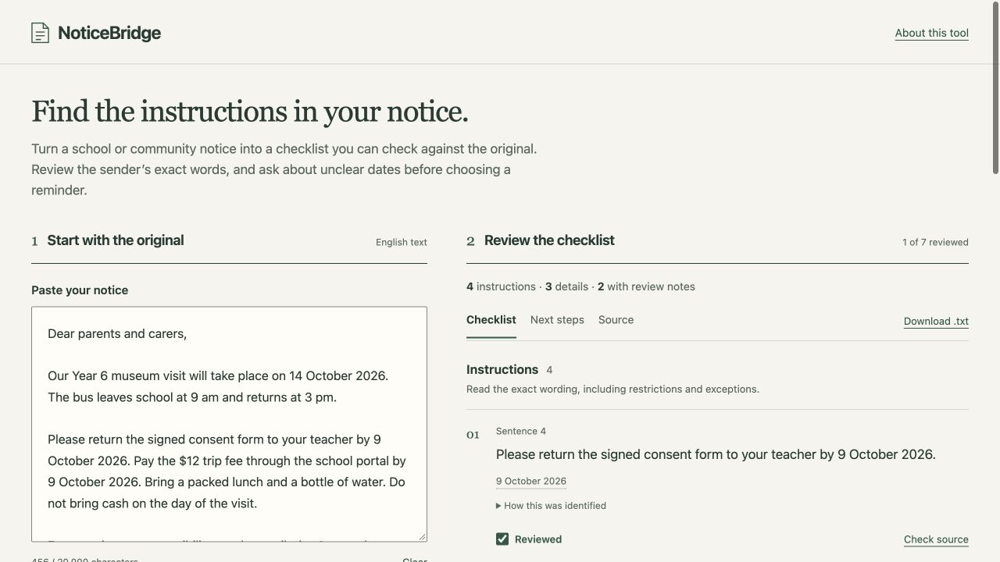
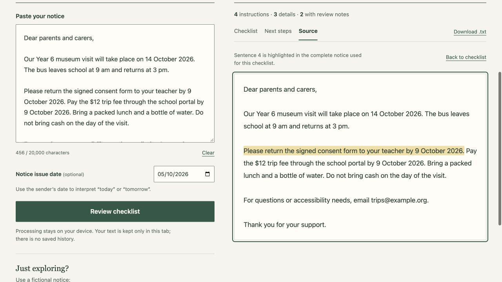
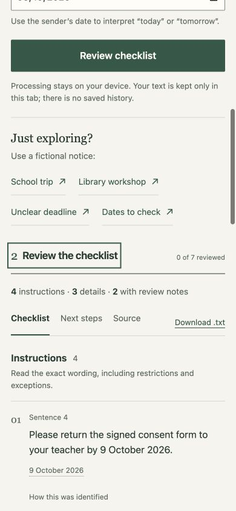

# NoticeBridge

Find the instructions in an everyday notice, then check them against the sender’s exact words.

**[Try the application](https://nicholas-afk.github.io/noticebridge/)** · [52-second captured walkthrough](https://nicholas-afk.github.io/noticebridge/media/noticebridge-demo.mp4) · [Devpost entry](https://devpost.com/software/noticebridge)

## One notice, four instructions

Choose **School trip** to load and analyze the fictional example. The fictional notice includes:

> Please return the signed consent form to your teacher by 9 October 2026. Pay the $12 trip fee through the school portal by 9 October 2026. Bring a packed lunch and a bottle of water. Do not bring cash on the day of the visit.

These four sentences appear as four instructions, in their original wording. **Check source** highlights the selected sentence inside the complete notice. Dates, times and amounts remain tied to their own sentence. No generated paraphrase replaces the source.



**Reviewed** means you checked the wording; it does not mean the task is done. All sentences remain accessible, including ones the model places in background. Read the complete notice because the classifier can miss instructions.

## Review uncertainty before acting

In **Next steps**, a valid full date from the same sentence can be suggested, but the confirmation starts unchecked. The reader must check it before saving a reminder. Editing or unchecking the date withdraws the saved reminder.

The **Dates to check** example quotes “9 or 12 October 2026” as alternatives, leaves its reminder date blank, flags the impossible “31 November 2026”, and recognizes “9 Oct. 2026”. Lists, ranges and one-or-both wording have distinct review notes and questions. The app does not choose an endpoint or resolve conflicting notices.

Readers can edit and download a question draft. Nothing is sent. Calendar downloads contain all-day entries with source quotations, no inferred time or alert. Text plans contain the full notice and review state. Import calendar files yourself; duplicate-import behavior varies by client and is unverified here.



Repeated analysis of the identical notice and issue date preserves review marks, reader edits, confirmations and reminders. Changing either pauses old work and all exports; a successful updated analysis starts fresh. Exact source reversion restores the matching checklist. Clear or reload discards tab progress. Files already downloaded or imported cannot be withdrawn.

## Local processing

No account, API key or backend is needed. Sentence classification runs in the browser using a trained TF–IDF/logistic regression model. Notice text and review progress stay in tab memory. The application requests same-origin code and model assets, without uploading the notice or using cloud inference, analytics, persistent history or a service worker. The host still receives ordinary page requests. Offline startup is unsupported; analysis can continue after the assets load. Downloaded files persist wherever you save them.

## Evidence and limitations

Release **1.4.2** refines review wording and presentation. Model **1.1.0**, extraction rules and calendar serialization are unchanged from the verified release.

| Development check | Original model | Model 1.1.0 |
| --- | ---: | ---: |
| Legacy sentence categories | 44/48 | 45/48 |
| Authored challenge categories | 30/40 | 35/40 |
| Authored raw instruction recall | 14/20 | 18/20 |
| Authored raw instruction precision | 14/15 (93.3%) | 18/21 (85.7%) |
| Authored instructions confidently listed | 2/20 | 10/20 |

**Precision worsened.** The three false raw instruction predictions remained Review under the unchanged thresholds. These same-author synthetic checks and five developer-selected public instructions do not establish real-world accuracy, accessibility or reader benefit. Scores are uncalibrated; unfamiliar language, sentence splitting and cross-sentence dependencies remain weaknesses. English only; no OCR, translation, uploads or conflict resolution. Intended for everyday notices, not legal, medical or emergency interpretation.

See [evaluation conditions and unfavorable results](EVALUATION.md), [model artifacts and every error](MODEL_CARD.md), [architecture and data boundaries](ARCHITECTURE.md), [competition assessment](docs/competition-assessment.md), and [release record](NOTICEBRIDGE_STATE.md).

Actual browser checks cover 320–1440 CSS-pixel widths, keyboard/source return, labels, focus, validation, changing-result announcements and exports. Twenty-five recorded axe checks from 1.4.1 had no violations. This is partial evidence. Actual screen-reader speech, physical phones, native browser zoom, OS date-picker interaction and calendar-client imports remain unverified. [Detailed accessibility/export audit](docs/accessibility-export-audit.md).



## Run and reproduce

Node 22.18.0 was used for the release checks. Runtime has no dependencies. Development tools are pinned by the lockfile.

```sh
npm ci
npm test
npm run build
npm run serve
```

Open `http://127.0.0.1:48137`. For local axe diagnostics, use `npm run serve:audit` and `http://localhost:48138/?qa=1`; diagnostics are absent from the public build.

```sh
python3 -m pip install -r requirements.txt
python3 train.py
npm run audit
npm run build
```

The audit checks scikit-learn/exported JavaScript parity, training overlap and baseline/current predictions. The original model is preserved in `docs/model-audit/baseline/`. Tests include source spans, follow-up safeguards, 100 date cases, eight model tests and ten real-app workflow tests. Independent calendar fixture parsing is documented in the export audit.

Publish the built `dist` tree to the existing `gh-pages` branch after preparing matching content fingerprints. [Demo source, provenance and manual journey](DEMO.md). Historical captures remain identified in [media inventory](media/README.md).

Created for ML Empowerment Build Challenge 3.0 under `ncywtanner`. OpenAI Codex assisted with concept, implementation, synthetic examples, testing and documentation. MIT licensed; demonstration fonts retain their separate OFL licenses.
